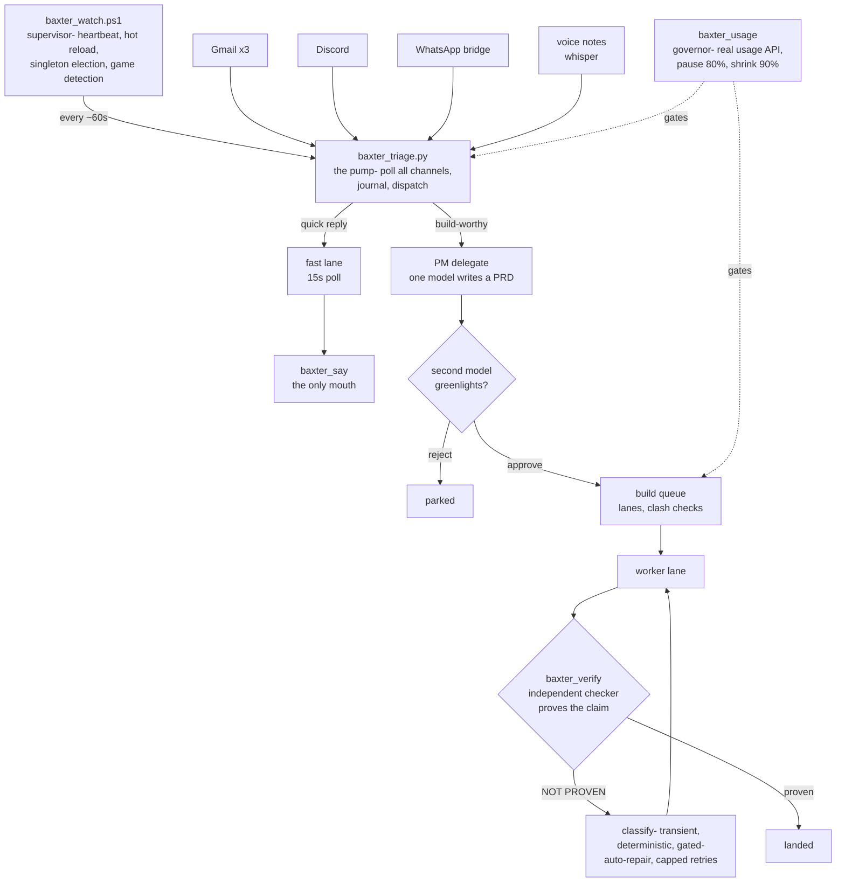

<picture>
  <source media="(prefers-color-scheme: dark)" srcset="docs/media/banner-dark.svg">
  
</picture>

Baxter is a personal AI chief-of-staff that runs 24/7 on my PC. It watches **Gmail
(3 accounts), Discord, WhatsApp, and voice notes**, triages everything into an
Obsidian vault, answers on Discord, and- this is the interesting part- **builds and
ships its own new features**, gated by a PRD process, a usage governor, and a
verification layer that refuses to believe a worker's "done" until a second,
independent process proves it.

This repo is the **curated core**: 25 of the system's ~210 modules, sanitized for
publication (paths, channel IDs, and addresses are anonymized; secrets were always
externalized and are not- and never were- in these files). It's a reference
implementation to read, not a turnkey install.

## The loop

## Design positions

**Nothing self-files.** An ask only becomes a build after one model instance writes
a PRD against a machine-checked template (`baxter_prd_template.py`- the touch-set
must be disjoint from other queued builds, the verify command must actually
resolve), and a *second* instance reviews and greenlights it (`baxter_pm_delegate.py`).

**Verify before trust.** Every lane exit runs `baxter_verify.py`: the declared
verify command, or a separate checker instance that observes behavior rather than
reading the diff. A worker saying "done" is a claim, not a fact. Failures are
classified- transient (retry once), deterministic (auto-repair, hard cap 3),
gated (park + notify)- and logged to a build-outcomes ledger.

**Meter the real thing.** `baxter_usage.py` polls the actual usage API rather than
estimating tokens (an estimating heuristic was demoted after it under-reported).
Triage pauses at 80% of budget, builds shrink at 90%, and the governor fails open
only after 45+ minutes of stale data.

**One mouth.** All outbound traffic goes through `baxter_say.py` + `baxter_send_dedup.py`.
Nothing sends to the outside world- no emails, no messages to anyone but me- and
double-send is structurally guarded, not vibes-guarded.

**Die loudly, heal quietly.** Three independent recovery layers:
- `baxter_stuck_doctor.py` detects lanes that stopped *thinking* (CPU-tree stall),
  not just ones that stopped running.
- `baxter_doctor_ai.py` has two *different* AI vendors diagnose Baxter blind and in
  parallel; a repair fires only on a unanimous, whitelisted, non-self-targeting
  verdict. Refusal is the default.
- `baxter_coop_guardian.py` keeps the sibling bots alive from *outside* the watcher,
  so one crash can't cascade through the family.

**Know which model you're holding.** `baxter_modelguard.py` is the single choke
point for which model tier and which tool scopes any spawn receives, with a runtime
drift detector- the expensive tier physically can't be selected for routine work.

## What's in the box

| Layer | Modules |
|---|---|
| Supervision | `baxter_watch.ps1` (1.8k lines- heartbeat, hot-reload with settle-window debounce, fullscreen-game detection), `baxter_coop_guardian.py`, `baxter_notify.ps1` |
| Ingestion | `baxter_triage.py` (5.4k- the pump), `baxter_gmail.py`, `baxter_slash.py` (Discord gateway + slash commands), `baxter_fast.py` (15s fast lane) |
| Governance | `baxter_usage.py` (6.5k- governor + build queue), `baxter_lanes.py`, `baxter_modelguard.py`, `baxter_rules.py` (the rules block every prompt carries) |
| Build system | `baxter_pm_delegate.py`, `baxter_prd_template.py`, `baxter_orch.py` (PLAN→EXECUTE→REVIEW), `baxter_verify.py` |
| Output | `baxter_say.py`, `baxter_send_dedup.py`, `baxter_react.py` + `baxter_reaction_watch.py` (👀→⚙️→✅ receipts, self-auditing), `baxter_reminders.py` |
| Self-repair | `baxter_stuck_doctor.py`, `baxter_doctor_ai.py`, `baxter_coop.py`, `baxter_siblings.py` |
| Meta | `baxter_flow_diagram.py`- renders the queue architecture as a PDF *derived from live constants*, so the diagram can't drift from the code |

## Tested like it matters

The full system carries **112 test files (~29k lines)** against ~48k lines of core-
a vocabulary of its own: `_exam` (68 scenario tests), `_check` (15), `_selftest`
(12), `_verify` (8), `_livecheck` (6, against the real system), `_e2e` (5),
`_redproof` (4, adversarial regressions), `_mutation_test` (2). Most core modules
also self-test via a `--selftest` flag. The exams aren't in this curated drop, but
the `--selftest` entry points are, in the modules themselves.

## Numbers that amuse me

- The watcher keeps its own heartbeat while a multi-minute triage runs, so the
  fast lane never starves behind a slow email batch.
- The reaction receipts (👀 seen, ⚙️ working, ✅ done) are reconciled against
  actually-delivered replies by a separate audit loop, because even the
  acknowledgements have a supervisor.
- Baxter has two sibling bots (different AI vendors) it consults as analysts- and
  a dedicated module whose only job is making sure it never answers a message
  addressed to one of them.

---

*Built by [Atul Kanodia](https://github.com/LolStar123), mostly by directing the
system to build itself- which is exactly why the PRD gate, the verify layer, and
the usage governor exist.*
