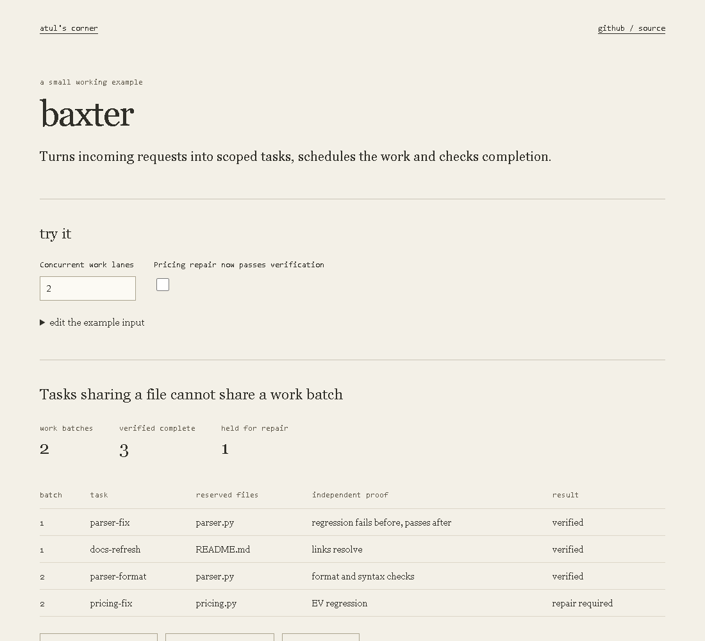
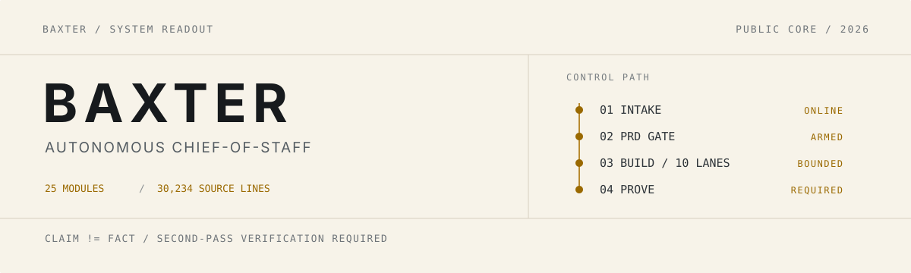
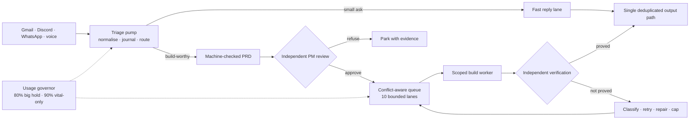

<!-- working-example:start -->
## Try it in a minute

**[Live example](https://lolstar123.github.io/baxter/)** · [Example code](examples/portfolio/model.mjs) · [Run locally](examples/portfolio/README.md) · [Atul's website](https://atul-kanodia-fieldnotes.atulswaggalicious.chatgpt.site)

Schedule overlapping tasks, change capacity and see failed evidence held for repair.



<!-- working-example:end -->

<picture>
  <source media="(prefers-color-scheme: dark)" srcset="docs/media/banner-dark.svg">
  
</picture>

# Baxter

Baxter is an autonomous chief-of-staff that turns Gmail, Discord, WhatsApp, and
voice-note inputs into a governed stream of replies, reminders, and build work.
It can propose and implement its own features, but it cannot simply declare them
finished: a machine-checked PRD, a second-model review, conflict-aware scheduling,
and an independent verification pass sit between an idea and a landed result.

This repository is the sanitised public core- 25 Python and PowerShell modules
from a larger, continuously running system. It is designed to be inspected and
tested without exposing the machine-specific integrations that operate it.

## System readout

| Signal | Observed in this repository |
|---|---|
| `SOURCE` | 23 Python modules + 2 PowerShell modules, 30,234 source lines |
| `INTAKE` | Three-account IMAP, Discord, a read-only WhatsApp feed, and a supervised voice-transcription handoff |
| `SCHEDULER` | 10 build lanes with declared touch-sets and live conflict checks |
| `GOVERNOR` | Big work holds at 80% session usage; routine work holds at 90%; vital work remains available |
| `PROOF` | The diagram self-test reports `22 nodes, 10 lanes, text extractable` |

The numbers above come from the checked-in source, not an external dashboard.
The commands under [Quickstart](#quickstart) reproduce the runnable checks.

## Control loop



The important boundary is between `WORKER` and `VERIFY`. A worker's completion
message is a claim. [baxter_verify.py](baxter_verify.py) runs the declared proof
separately, classifies the failure, and records the outcome before anything is
treated as landed.

## Why the system is difficult

**It schedules edits, not just tasks.** Each queued build declares the files or
regions it may touch. [baxter_usage.py](baxter_usage.py) refuses vague hub-file
claims, detects overlapping work, and prevents colliding lanes from running
together.

**It has one mouth.** Replies pass through
[baxter_say.py](baxter_say.py) and
[baxter_send_dedup.py](baxter_send_dedup.py). Shared claim ledgers and locks make
duplicate delivery a structural failure instead of a prompt-level suggestion.

**It verifies the verifier.** PRD checks reject proofs that cannot fail, malformed
commands, missing touch-set paths, and trivial checks that already pass before
the build starts.

**It degrades deliberately.** The usage governor drains or holds new work by
class while keeping the vital reply path alive. Meter staleness, reset windows,
and explicit breach controls are encoded as state transitions rather than token
estimates.

**It supervises its own supervision.** The watcher maintains heartbeats during
long triage passes, the reaction audit reconciles visible work receipts against
delivered replies, and the stuck doctor measures process-tree progress instead
of trusting that a PID still exists.

## Quickstart

The public core is a readable reference implementation, not a turnkey daemon.
Its production adapters and secrets remain outside this repository. The
self-contained checks below are the fastest way to exercise real control paths:

```powershell
git clone https://github.com/LolStar123/baxter.git
cd baxter
python baxter_modelguard.py --selftest
python baxter_reaction_watch.py --selftest
python baxter_prd_template.py --print
```

Expected proof lines:

```text
modelguard selftest OK: 12 classes, file=haiku, prose=sonnet, fast=sonnet, flagship=opus, Fable refused.
PHANTOM-COG SELFTEST OK
```

The third command prints the actual 74-line PRD form used by the gate. To verify
the code-derived architecture diagram as well:

```powershell
python -m pip install matplotlib
python baxter_flow_diagram.py --selftest
```

That check returns `SELFTEST OK (22 nodes, 10 lanes, text extractable)`.

## Module map

| Layer | Primary modules | Responsibility |
|---|---|---|
| Supervision | [baxter_watch.ps1](baxter_watch.ps1), [baxter_stuck_doctor.py](baxter_stuck_doctor.py), [baxter_coop_guardian.py](baxter_coop_guardian.py) | Heartbeats, hot reload, liveness, and recovery |
| Intake | [baxter_triage.py](baxter_triage.py), [baxter_gmail.py](baxter_gmail.py), [baxter_slash.py](baxter_slash.py) | Read, normalise, route, and expose commands |
| Governance | [baxter_usage.py](baxter_usage.py), [baxter_lanes.py](baxter_lanes.py), [baxter_modelguard.py](baxter_modelguard.py) | Budget gates, lane ownership, and model policy |
| Build | [baxter_prd_template.py](baxter_prd_template.py), [baxter_pm_delegate.py](baxter_pm_delegate.py), [baxter_orch.py](baxter_orch.py) | Specify, review, plan, execute, and review again |
| Proof | [baxter_verify.py](baxter_verify.py), [baxter_rules.py](baxter_rules.py) | Independent acceptance and prompt-rule integrity |
| Output | [baxter_say.py](baxter_say.py), [baxter_send_dedup.py](baxter_send_dedup.py), [baxter_reaction_watch.py](baxter_reaction_watch.py) | One delivery path, deduplication, and receipt repair |
| Diagnosis | [baxter_doctor_ai.py](baxter_doctor_ai.py), [baxter_coop.py](baxter_coop.py) | Bounded multi-model diagnosis and analyst fan-out |

## Contributing

Keep changes narrow, preserve the fail-closed gates, and extend a self-test when
behaviour changes. Never add real account identifiers, machine usernames,
absolute personal paths, inbox content, or credentials. Open an issue first for
changes that widen an outward action or weaken an approval boundary.

## Licence

[MIT](LICENSE). Built by [Atul Kanodia](https://github.com/LolStar123).
