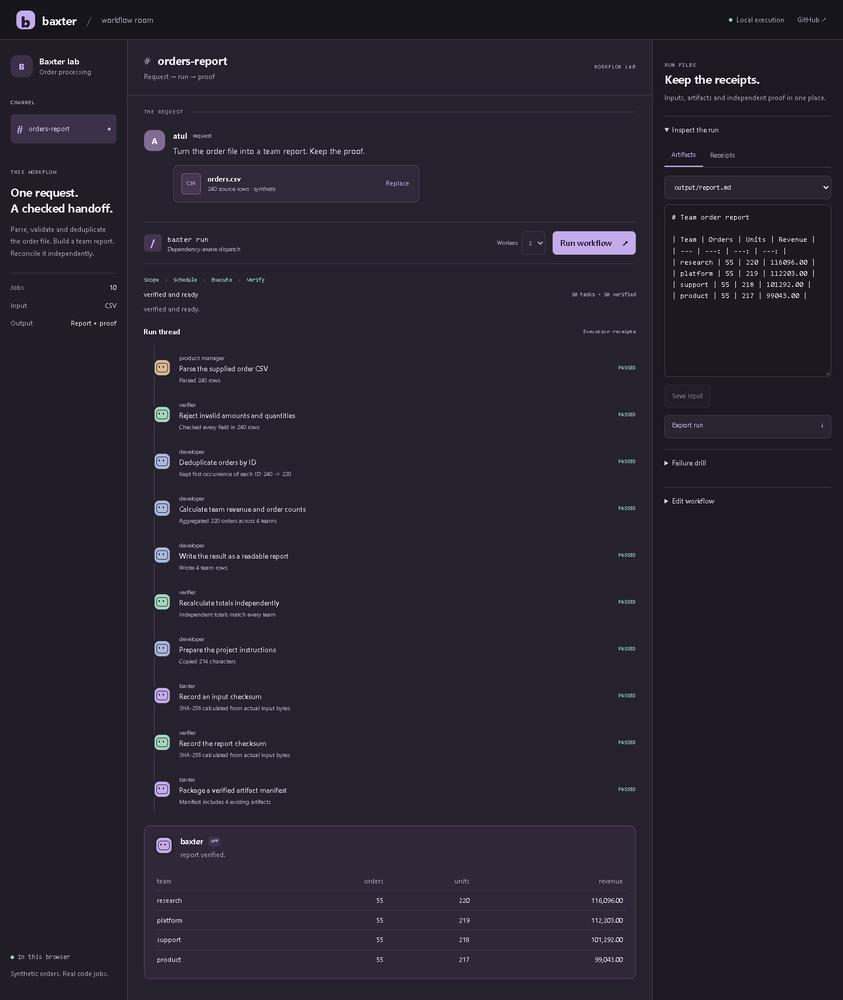
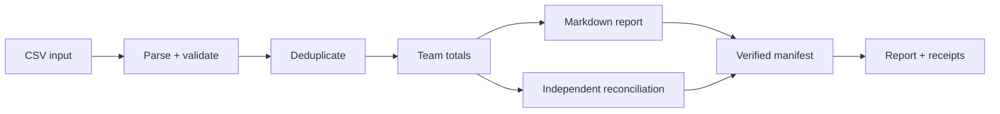

# Baxter

A Discord-first coordinator with a separate proof gate between completed work and a delivered result.

**[Open the workflow room](https://lolstar123.github.io/baxter/)** · [Browser code](examples/portfolio) · [Public-core scope](PROVENANCE.md)



## Try it

Click **Run workflow**. Ten executable jobs process 240 synthetic CSV rows, keep 220 unique orders and write a team report. A separate job recalculates the totals; the handoff appears only after every job passes. The completed report appears above the job thread. Artifacts and timed receipts stay in the inspector.

- Replace the CSV attachment or edit an input in the inspector, save it and rerun.
- Select **Receipts** to read each job's proof, duration and output paths.
- Open **Failure drill**, break one quantity and run again. Validation fails and dependent work is blocked. **Restore example** recovers the original input.
- **Export run** downloads the input, generated files, task definitions, states and receipts together.

The browser executes deterministic JavaScript in Web Workers. It makes no model call and sends no Discord message. Uploaded files stay in the tab; refreshing clears them. CSV uploads are limited to 250 KB. The synthetic fixture has no real customer records.

## Run locally

The browser lab needs Python 3 for serving files and a modern browser. Node.js 20+ runs the model tests and the matching command-line workflow. There is no npm installation step.

```powershell
git clone https://github.com/LolStar123/baxter.git
cd baxter
python -m http.server 8000 --bind 127.0.0.1 --directory examples/portfolio
```

Open [localhost:8000](http://localhost:8000). Serve over HTTP; opening `index.html` directly will prevent module workers and fixture loading. Stop the server with Ctrl+C.

In another terminal:

```powershell
node --test examples/portfolio/model.test.mjs
node tools/run_workflow.mjs
```

Expected: four tests pass, then `10/10 jobs passed`. The runner writes `output/workflow-receipts.json`. Its independent totals proof records `checkedOrders: 220`.

## How the lab works


```mermaid
flowchart LR
    CSV[CSV input] --> Parse[Parse + validate]
    Parse --> Clean[Deduplicate]
    Clean --> Totals[Team totals]
    Totals --> Report[Markdown report]
    Totals --> Verify[Independent reconciliation]
    Report --> Gate[Verified manifest]
    Verify --> Gate
    Gate --> Handoff[Report + receipts]
```

| File | Responsibility |
|---|---|
| [`examples/portfolio/app.mjs`](examples/portfolio/app.mjs) | Dispatch, UI states, input replacement and export |
| [`examples/portfolio/model.mjs`](examples/portfolio/model.mjs) | Task validation, file conflicts, dependency scheduling and executable jobs |
| [`examples/portfolio/worker.mjs`](examples/portfolio/worker.mjs) | Isolated job execution |
| [`examples/portfolio/data/workflow.json`](examples/portfolio/data/workflow.json) | Synthetic CSV and ten declared tasks |
| [`tools/run_workflow.mjs`](tools/run_workflow.mjs) | Node runner using the same job implementations |
| [`tools/browser_audit.py`](tools/browser_audit.py) | Browser execution, failure/recovery, uploads, keyboard and export checks |

Each worker receives only its declared input files. Dispatch respects capacity, dependencies and overlapping read/write paths. A worker times out after ten seconds; failed prerequisites block dependent jobs. Receipts report actual elapsed execution time, including worker startup.

## The original system

The public core contains the Python and PowerShell coordination modules from the original local system. Gmail, Discord, a read-only WhatsApp feed and supervised voice transcription feed its intake. Work passes through a machine-checked PRD, independent review, bounded build lanes and an independent verifier before the shared delivery path accepts it.

This core is a reference implementation. Production adapters, credentials and machine-specific configuration are outside the repository; cloning it does not start a working daemon. The browser lab makes its scheduling and proof mechanisms inspectable without those integrations.

| Layer | Start here |
|---|---|
| Intake and commands | [`baxter_triage.py`](baxter_triage.py), [`baxter_gmail.py`](baxter_gmail.py), [`baxter_slash.py`](baxter_slash.py) |
| Capacity and governance | [`baxter_usage.py`](baxter_usage.py), [`baxter_lanes.py`](baxter_lanes.py), [`baxter_modelguard.py`](baxter_modelguard.py) |
| Specification and execution | [`baxter_prd_template.py`](baxter_prd_template.py), [`baxter_pm_delegate.py`](baxter_pm_delegate.py), [`baxter_orch.py`](baxter_orch.py) |
| Acceptance | [`baxter_verify.py`](baxter_verify.py), [`baxter_rules.py`](baxter_rules.py) |
| Delivery and supervision | [`baxter_say.py`](baxter_say.py), [`baxter_send_dedup.py`](baxter_send_dedup.py), [`baxter_watch.ps1`](baxter_watch.ps1) |

Run the self-contained source checks:

```powershell
python baxter_modelguard.py --selftest
python baxter_reaction_watch.py --selftest
python baxter_prd_template.py --print
```

Expected: `modelguard selftest OK`, `PHANTOM-COG SELFTEST OK`, then the PRD form. The historical model names printed by modelguard belong to this source snapshot, not the browser workers.

## Browser verification

```powershell
python -m pip install playwright
python -m playwright install chromium
python tools/browser_audit.py
```

The audit uses installed Chrome on Windows and Playwright Chromium elsewhere. It starts its own loopback server and checks actual worker outputs, blocked handoffs, recovery, CSV upload and rejection, invalid task JSON, keyboard activation, repeated inspector clicks, download contents, fixture-load errors and reduced motion. It captures desktop and 390 px mobile views in `output/playwright/`; the desktop view also updates the screenshot above.

These checks do not establish production Discord delivery or model-agent quality. Keep real integrations and account data out of the public lab.

[MIT license](LICENSE) · Built by [Atul Kanodia](https://github.com/LolStar123)
